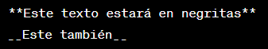
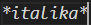
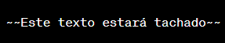
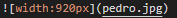

# Bienvenido al Tutorial de Mark Down

---
---
# Negritas
Para hacer que un texto aparezca en negritas en Markdown, simplemente coloca dos asteriscos ** o dos guiones bajos __ alrededor del texto que deseas destacar.
- Ejemplo:
**Este texto estará en negritas**
__Este también__

---
# Inclinar la Tipografía 
Markdown es principalmente un lenguaje de marcado simple, por lo que para poner el texto inclinado se necezita estar entre un * de cada lado del texto.
-Ejemplo de cursiva
*italika*

---
---
# Tachar un Texto
Para tachar un texto, puedes usar dos virgulillas ~~ alrededor del texto que deseas tachar.
-Ejemplo de tachar
~~Este texto estará tachado~~

---
# Titulo 1
## Titulo 2
### Titulo 3
#### Titulo 4
##### Titulo 5
###### Titulo 6
---
# Subrayar un Texto

---

## Fight Club (1999) Dir. David Fincher

---
# Tabla 
|Titulo 1| Titulo 2|
|---|---|
|Celda 1| Celda 2|
|Celda 3|Celda 4|

[coment]: <> (This is a comment, it will not be included)